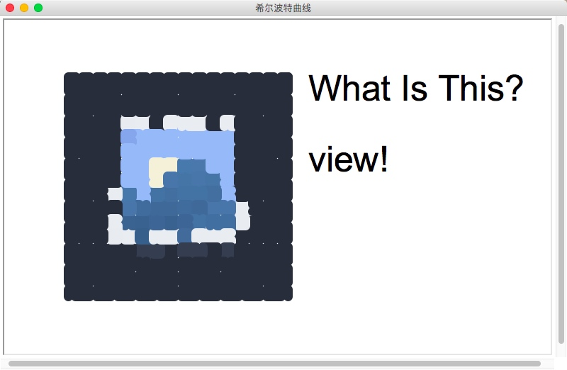
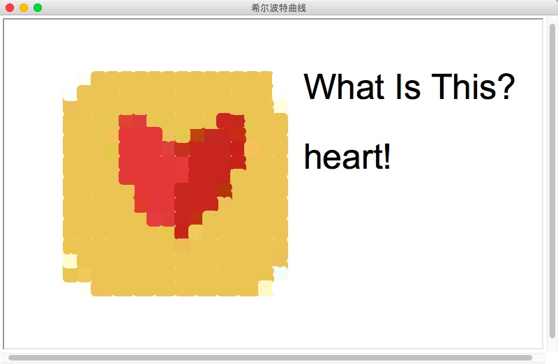

# Turtle
##purpose: To design a python program which can **draw** picture by the picture given
- First of all, we use OpenCV to get all the pixel RGP data of the picture given.
- Then, we use Turtle to draw a Hilbert curve to cover the picture.
- As running though, in every Hilbert loop, we set the color with the very first pixel of each loop.
-In this way, every block is filled with the color near by the area.

The output is as below:

